# 🍽️ **Cravy – Food Delivery Website**

A full-stack food delivery web application built with the **MERN** stack.

## 🛠️ **Tech Stack**

- 🍃 **MongoDB**
- ⚙️ **Express.js**
- ⚛️ **React.js**
- 🌐 **Node.js**
- 💳 **Stripe API**
- 🎨 **Tailwind CSS**

## ✨ **Features**

- 🍲 **Dynamic food menu** with categories 
- 🛍️ **Cart management** – add, remove items  
- 🔐 **User authentication** using JWT  
- 💳 **Integrated Stripe payment gateway**  
- 📦 **Order placement and confirmation system**  
- 👨‍🍳 **Admin panel** for food & order management
- 📱 **Fully responsive design** with Tailwind CSS

  ## 🎥 Project Demo

Click the link below to view a walkthrough of the Cravy web application:

👉 [Watch the Demo Video](https://drive.google.com/file/d/1lHg3pVVewGOS7VZK_XfyK-Y7HsTnqKuk/view?usp=sharing)

---
  
## 🖼️ Screenshots
HomePage
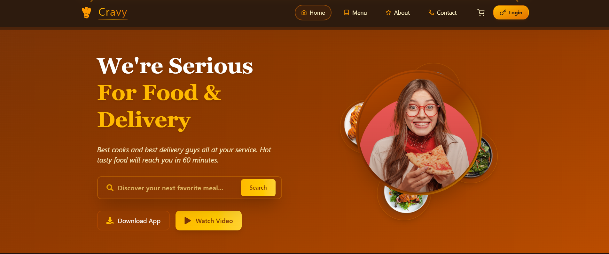
Menu
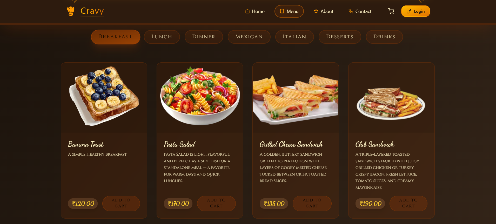
SignupPage
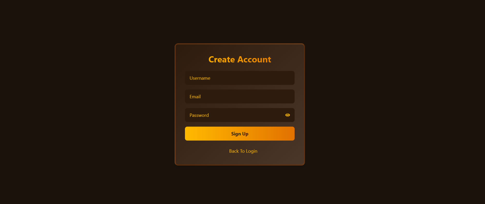
LoginPage
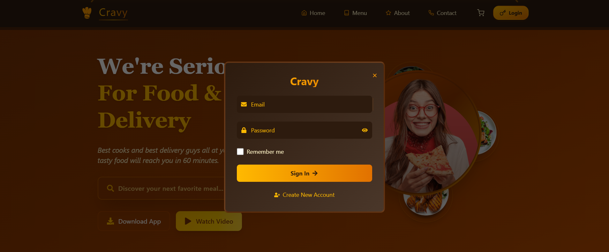
MongodbEntry
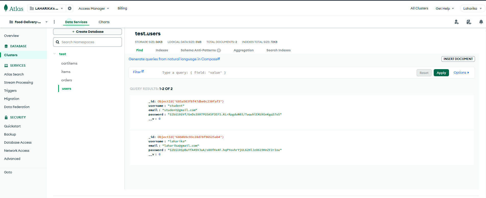
CheckoutPage
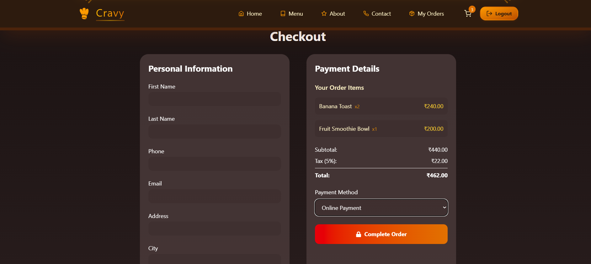
OrderDataEntry
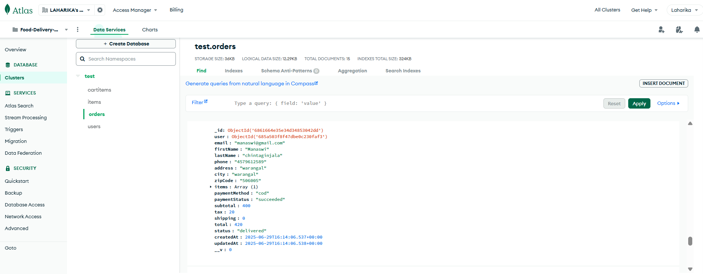
PaymentPage
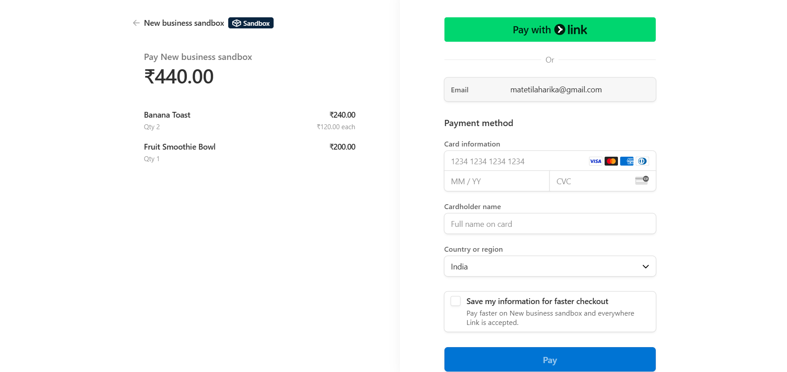
AdminPanel
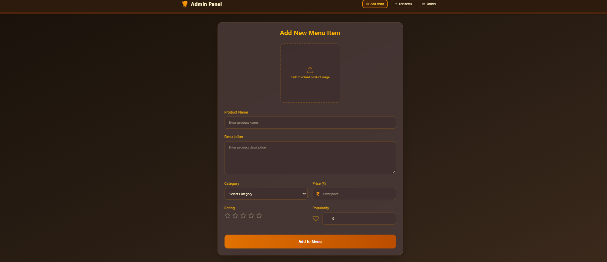
ContactPage
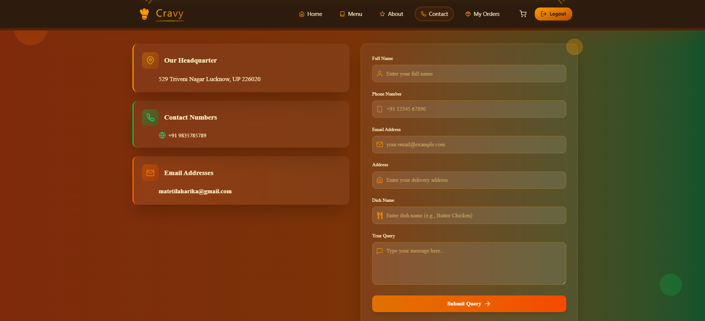
Footer
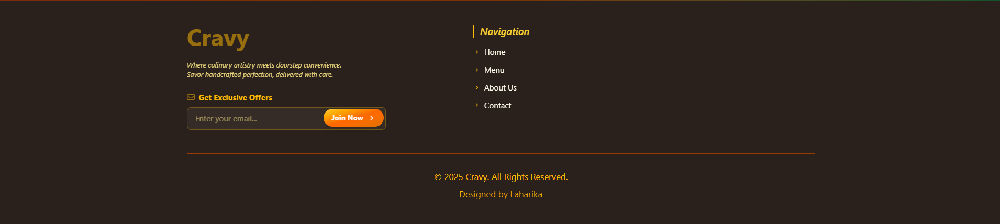

